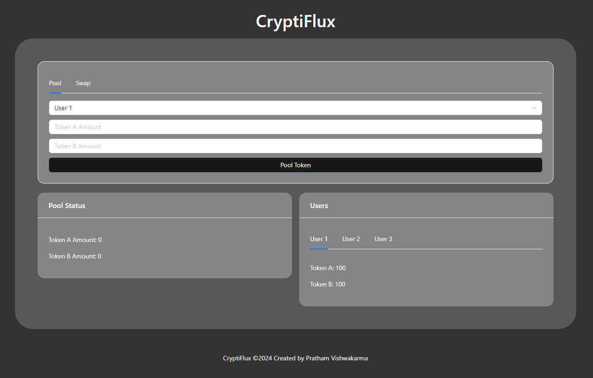
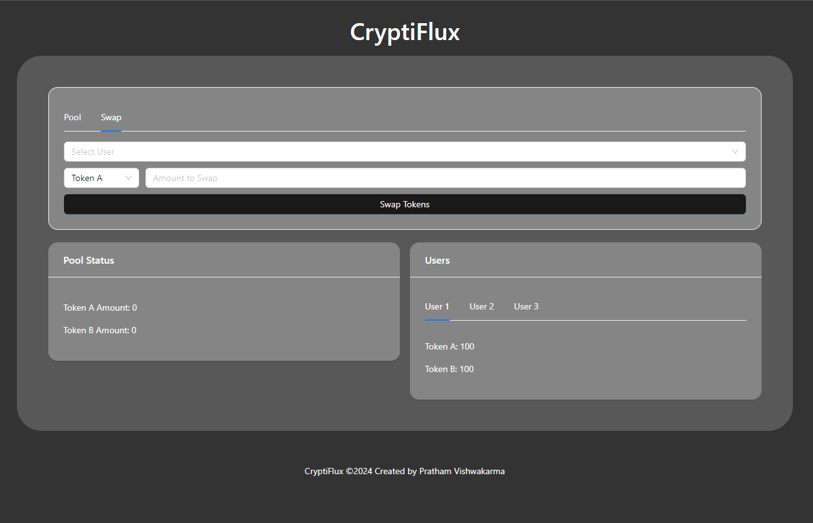

<p align="center">
  
</p>
<h1 align="center">CryptiFlux</h1>
<p align="center"><em>Simulated Token Pooling & Swapping on Aptos</em></p>

CryptiFlux is a **React + TypeScript-based simulation platform** that allows users to **simulate token pooling and swapping** on the **Aptos blockchain**. It provides a clean and responsive UI with **Ant Design**, supports **multiple users**, and offers a safe environment to **experiment with decentralized finance concepts**. This makes it useful for **blockchain learners, developers, and DeFi enthusiasts**.

---

<div align="center">

[](https://github.com/Pratham-Vishwakarma/CryptiFlux/stargazers)
[](https://github.com/Pratham-Vishwakarma/CryptiFlux/network/members)
[](https://github.com/Pratham-Vishwakarma/CryptiFlux/blob/main/license.txt)
[](https://github.com/Pratham-Vishwakarma/CryptiFlux/issues)
[](https://github.com/Pratham-Vishwakarma/CryptiFlux)


</div>

---

## Table of Contents

- [Table of Contents](#table-of-contents)
- [Features](#features)
- [Installation / Setup](#installation--setup)
- [Usage](#usage)
  - [General User](#general-user)
  - [Developer](#developer)
- [Screenshots / Demo](#screenshots--demo)
- [Project Structure](#project-structure)
- [Configuration](#configuration)
- [Contributing Guidelines](#contributing-guidelines)
- [Roadmap](#roadmap)
- [Built With / Tech Stack](#built-with--tech-stack)
- [Authors / Acknowledgements](#authors--acknowledgements)
- [License](#license)
- [Support / Contact](#support--contact)

## Features

* 📊 <u>**Liquidity Pooling**</u> – Pool tokens into a shared liquidity pool.  
* 🔄 <u>**Token Swapping**</u> – Swap tokens seamlessly via the pool.  
* 👥 <u>**User Management**</u> – Manage multiple users with distinct balances.  
* 📱 <u>**Responsive UI**</u> – Built with Ant Design for clean visuals.  
* ⚡ <u>**Fast Transactions**</u> – Powered by the Aptos blockchain.  
* 🔐 <u>**Secure Environment**</u> – Blockchain-backed, decentralized architecture.  
* 🧩 <u>**Customizable Users**</u> – Easily modify token balances and add new users.  
* 🎯 <u>**Simple UX**</u> – Easy-to-use interface for both traders & developers.  

## Installation / Setup

**Prerequisites:**

* [Node.js](https://nodejs.org/en/download/) (v14 or later)  
* [npm](https://www.npmjs.com/get-npm) or [yarn](https://yarnpkg.com/getting-started/install)  
* [Aptos CLI](https://aptos.dev/)  
* [Petra Wallet](https://petra.app/) (for simulation purposes)  
* [Move (Aptos Smart Contract)](https://move-language.github.io/move/)
* [Typescript](https://www.typescriptlang.org/docs/)
* [React.js](https://react.dev/)
* [Ant Design](https://ant-design.antgroup.com/docs/react/introduce)

**Steps for Installation:**

1. **Install Rust (required for Move CLI)**

```bash
curl --proto '=https' --tlsv1.2 -sSf https://sh.rustup.rs | sh
rustc --version  # Verify Rust installation
```

2. **Install Aptos CLI**

```bash
# Using Cargo (Rust package manager)
cargo install aptos

# Verify installation
aptos --version
```

> ⚠️ Optionally, you can download a precompiled binary from [Aptos CLI Releases](https://github.com/aptos-labs/aptos-core/releases/latest).

3. **Clone CryptiFlux repository**

```bash
git clone https://github.com/Pratham-Vishwakarma/CryptiFlux.git
cd CryptiFlux
```

4. **Install Node.js dependencies**

```bash
npm install
# or
yarn install
```

5. **Initialize Aptos configuration**

```bash
aptos init
```

This will generate a hidden folder `.aptos/` in your project root, containing:

* `config.yaml` → Aptos profile & network details.
* `private-keys.yaml` → your local dev private key(s).

> ⚠️ `.aptos/` is never cloned from GitHub (it’s local-only) and should remain **gitignored**, since it contains sensitive keys. Every contributor needs to run `aptos init` themselves.

6. **Update Move.toml with your dev address**

Open `move/Move.toml` and locate the `[addresses]` section:

```toml
[addresses]
my_addr = "0x1"  # Default placeholder
```

Replace `0x1` with your generated **dev address** from `.aptos/config.yaml`:

```toml
[addresses]
my_addr = "YOUR_PRIVATE_ADDRESS"
```

> ⚠️ This address is only for **local compilation and simulation**. No real funds are used.

7. **Set up Aptos Framework dependency**

Ensure the `[dependencies.AptosFramework]` section looks like this:

```toml
[dependencies.AptosFramework]
git = "https://github.com/aptos-labs/aptos-core.git"
rev = "mainnet"
subdir = "aptos-move/framework/aptos-framework"
```

8. **Download the Move dependencies**

```bash
# Navigate to the move folder
cd ..
cd move

# Fetch dependencies
aptos move fetch-deps
```

9. **Compile Move Modules**

```bash
aptos move compile
```

> ✅ This ensures all dependencies are ready and your Move modules are compiled correctly.


## Usage

### General User

1. Start the app with `npm start` or `yarn start`.
2. Open [http://localhost:3000](http://localhost:3000).
3. Choose a user from the dropdown.
4. Pool tokens or swap tokens as needed.

### Developer

```bash
# Start development server
npm start
# or
yarn start

# Build production version
npm run build
# or
yarn build
```

* Modify the `users` state to change default balances or add new users.
* Update Move modules in the `move` folder and recompile with `aptos move compile`.

> ⚠️ **Note:** CryptiFlux is a **simulation platform only**. No real tokens are used or transferred.

## Screenshots / Demo

<div align="center">
  

</div>  

## Project Structure

```
/client                     -> source code for frontend
/client/src/index.tsx       -> entry point for frontend

/move                       -> source code for blockchain
/move/sources/contract.move -> entry node of blockchain's smart contract

/images                     -> demo screenshots
```

## Configuration

* No extra configuration required for setup.

## Contributing Guidelines

1. Fork the repository.
2. Create a feature branch (`git checkout -b feature-name`).
3. Commit your changes (`git commit -m "Add feature"`).
4. Push to the branch (`git push origin feature-name`).
5. Open a Pull Request.

## Roadmap

* [ ] Add wallet integration for real Aptos accounts (e.g., Petra Wallet).
* [ ] Implement real token contracts instead of mock balances.
* [ ] Add transaction history tracking for users.
* [ ] Improve pool analytics dashboard with charts and stats.
* [ ] Support multiple pools with different token pairs.
* [ ] Enable advanced swap features (e.g., slippage control, price impact simulation).
* [ ] Integrate with Aptos testnet for safe experimentation with real tokens.
* [ ] Optimize UI/UX for both desktop and mobile.
* [ ] Add tutorial mode to guide new users through simulation steps.
* [ ] Gradually enhance the platform toward a fully functional DEX application.

## Built With / Tech Stack

| Component        | Purpose                                                 |
| ---------------- | ------------------------------------------------------- |
| TypeScript       | Core programming language                               |
| React.js         | Frontend framework for UI development                   |
| Ant Design       | UI component library                                    |
| Node.js          | Backend runtime and development environment             |
| Aptos Blockchain | Blockchain backend for token handling                   |
| Move             | Smart contract language for Aptos                       |
| Petra Wallet     | Wallet for interacting with Aptos accounts (simulation) |
| npm / yarn       | Package management                                      |

## Authors / Acknowledgements

* **Pratham Vishwakarma** – Developer & Maintainer
* Thanks to **React, Ant Design, and Aptos** communities for tools and resources.

## License

CryptiFlux is licensed under the [MIT License](license.txt).

## Support / Contact

* **Email:** [pratham.vishwakarma125940@gmail.com](mailto:pratham.vishwakarma125940@gmail.com)
* **GitHub:** [Pratham-Vishwakarma](https://github.com/Pratham-Vishwakarma)
* **LinkedIn:** [Pratham Vishwakarma](https://www.linkedin.com/in/pratham-vishwakarma/)
* **X:** [@pratham1826](https://www.x.com/pratham1826/)